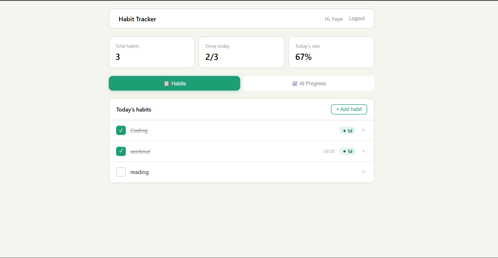

# Habit Tracker

**Habit Tracker** is a web application for tracking daily habits with Telegram bot integration, AI-powered reports, and a React dashboard.

---

## Demo




---

## Product Context

### End Users

People who want to build positive habits or break bad ones: students, freelancers, professionals pursuing a healthier lifestyle. The product is suitable for both personal use and team collaboration (e.g., habit trackers within corporate wellness programs).

### Problem

Many people start forming habits (exercise, meditation, reading, early rising) but quit after a few days due to lack of feedback, reminders, and a sense of progress. Existing apps are either too complex or fail to provide personalized motivation.

### Solution

Habit Tracker offers a simple and motivating way to track habits via a web interface and a Telegram bot. Users get:

- Automatic reminders in Telegram
- AI-powered weekly reports with personalized recommendations
- Streaks and statistics to visualize progress
- The ability to log habits on the go via the bot or the web dashboard

---

## Features

### Implemented Features

| Feature | Description |
|---------|-------------|
| **Registration & Auth** | Web registration with JWT authentication |
| **Habit Creation** | Add habits with optional reminder times |
| **Completion Tracking** | Checkboxes on the web dashboard, inline buttons in the Telegram bot |
| **Streaks** | Automatic consecutive-day counter for each habit |
| **Statistics** | Weekly completion rate, current streaks |
| **Telegram Bot** | Commands: `/start`, `/add`, `/done`, `/list`, `/stats`, `/report`, `/schedule`, `/delete`, `/timezone`, `/help`, `/advise`, `/rolemodel`, `/suggest`, `/insights` |
| **AI Reports** | Weekly personalized reports via OpenRouter (GPT) |
| **Report Scheduling** | Choose day of week and time for automatic delivery |
| **AI Recommendations** | `/advise` (habit advice), `/suggest` (habit suggestions), `/rolemodel` (habits for a profession) |
| **Saved Insights** | View saved AI recommendations via `/insights` |
| **Telegram Linking** | Connect web account to Telegram via a 6-digit code |
| **Progress Dashboard** | "AI Progress" tab on the web dashboard |
| **REST API** | Full set of endpoints for CRUD operations on habits, users, completions |

### Planned Features

| Feature | Status |
|---------|--------|
| Mobile app (iOS/Android) | Not implemented |
| Browser push notifications | Not implemented |
| Habit categories and tags | Not implemented |
| Social features (leaderboards, friends) | Not implemented |
| Data export (CSV, PDF) | Not implemented |
| Dark theme | Not implemented |
| Calendar integration (Google Calendar) | Not implemented |
| Group habits (family, team) | Not implemented |
| End-to-end data encryption | Not implemented |

---

## Usage

### For End Users

1. **Open the web application** (URL of the deployed frontend).
2. **Register** — enter your email, name, and password.
3. **Link the Telegram bot** — copy the 6-digit code from the dashboard and send it to the bot with `/start CODE`.
4. **Add habits** — via the "+ Add habit" button on the dashboard or the `/add` command in Telegram.
5. **Log completions** — click the checkbox on the dashboard or use `/done` in the bot.
6. **Receive AI reports** — manually via `/report` or set up automatic delivery via `/schedule`.

### For Administrators / Developers

See the "Deployment" section below.

---

## Deployment

### Virtual Machine Requirements

| Parameter | Value |
|-----------|-------|
| **OS** | Ubuntu 24.04 LTS |
| **CPU** | 2 cores minimum |
| **RAM** | 2 GB minimum (4 GB recommended) |
| **Disk** | 20 GB free space |
| **Network** | Open ports: 80 (HTTP), 443 (HTTPS, when using reverse proxy) |

### Required Software

The following must be installed on the VM:

```bash
# Docker and Docker Compose
sudo apt update
sudo apt install -y docker.io docker-compose-v2

# Git
sudo apt install -y git

# (Optional) Nginx — as a reverse proxy for production
sudo apt install -y nginx
```

Ensure Docker is running and added to your user group:

```bash
sudo systemctl enable --now docker
sudo usermod -aG docker $USER
# Re-login to your SSH session for the group change to take effect
```

### Step-by-Step Instructions

#### 1. Clone the Repository

```bash
cd ~
git clone https://github.com/yourusername/habit-tracker.git
cd habit-tracker
```

#### 2. Create the Environment File

```bash
cp .env.example .env
```

Edit `.env` and set:

```env
# Telegram Bot Token — get from @BotFather in Telegram
BOT_TOKEN=123456789:ABCdefGHIjklMNOpqrsTUVwxyz

# OpenRouter API Key — for AI reports (https://openrouter.ai)
OPENROUTER_API_KEY=sk-or-v1-xxxxxxxxxxxx

# (Optional) Override database URL
# DATABASE_URL=postgresql://habit_user:habit_pass@db:5432/habitdb
```

#### 3. Create a Telegram Bot

1. Open **@BotFather** in Telegram.
2. Send `/newbot` and follow the instructions.
3. Copy the token into `BOT_TOKEN` in the `.env` file.

#### 4. Create an OpenRouter API Key

1. Register at https://openrouter.ai
2. Create an API key in your account dashboard.
3. Copy the key into `OPENROUTER_API_KEY` in the `.env` file.

#### 5. Start the Services

```bash
docker compose up --build -d
```

This launches 5 containers:

| Service | Port | Description |
|---------|------|-------------|
| **db** | 5432 | PostgreSQL 16 |
| **backend** | 8000 | FastAPI API |
| **bot** | — | aiogram Telegram bot |
| **frontend** | 3000 | React + Vite |
| **pgadmin** | 5050 | pgAdmin for database management |

#### 6. Verify the Installation

Open in your browser:

- **Frontend**: `http://<YOUR_VM_IP>:3000`
- **API Docs (Swagger)**: `http://<YOUR_VM_IP>:8000/docs`
- **pgAdmin**: `http://<YOUR_VM_IP>:5050` (login: `admin@habit.local`, password: `admin`)

#### 7. (Optional) Configure Nginx as a Reverse Proxy

Create the config file `/etc/nginx/sites-available/habit-tracker`:

```nginx
server {
    listen 80;
    server_name your-domain.com;

    location / {
        proxy_pass http://127.0.0.1:3000;
        proxy_set_header Host $host;
        proxy_set_header X-Real-IP $remote_addr;
    }

    location /api/ {
        proxy_pass http://127.0.0.1:8000;
        proxy_set_header Host $host;
    }
}
```

Enable and restart:

```bash
sudo ln -s /etc/nginx/sites-available/habit-tracker /etc/nginx/sites-enabled/
sudo nginx -t && sudo systemctl restart nginx
```

#### 8. (Optional) Configure Auto-Start

```bash
# Create a systemd service
sudo tee /etc/systemd/system/habit-tracker.service > /dev/null <<EOF
[Unit]
Description=Habit Tracker Docker Compose
After=docker.service
Requires=docker.service

[Service]
Type=oneshot
RemainAfterExit=yes
WorkingDirectory=/home/$USER/habit-tracker
ExecStart=/usr/bin/docker compose up -d
ExecStop=/usr/bin/docker compose down

[Install]
WantedBy=multi-user.target
EOF

sudo systemctl enable --now habit-tracker
```

### Updating

```bash
cd ~/habit-tracker
git pull
docker compose up --build -d
```

### Stopping

```bash
cd ~/habit-tracker
docker compose down
```

To remove all data (including the database):

```bash
docker compose down -v
```

---

## License

MIT — see [LICENSE](LICENSE).
